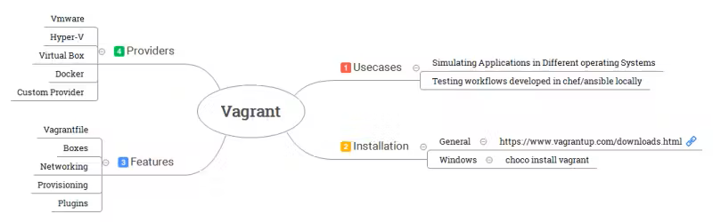
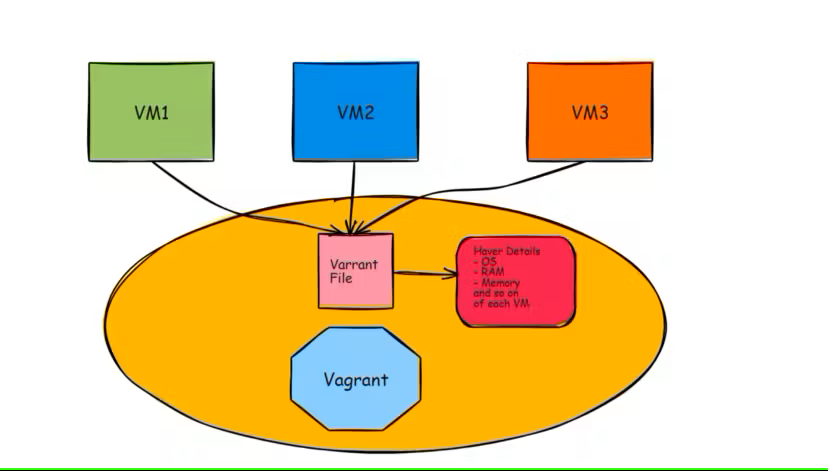
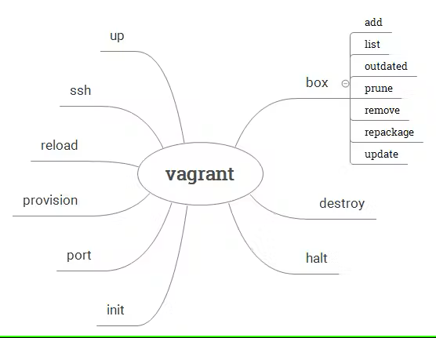

# Vagrant : [DevOps Journey: Vagrant 101 Tutorial - All you need to know to get started with Vagrant](https://www.youtube.com/watch?v=a6W1hF9CgDQ)

Vagrant est un outil de gestion de machines virtuelles (VMs) qui simplifie le processus de création, de configuration et de déploiement d'environnements de développement reproductibles (environnements de développement homogènes). Il permet aux développeurs de configurer rapidement des environnements de travail identiques, facilitant ainsi le partage de configurations entre les membres d'une équipe et garantissant que le code fonctionne de manière cohérente sur différents systèmes.

  

Gérer diverses machines virtuelles et les configurer est assez fastidieux. Avec Vagrant, nous pouvons gérer, configurer et exécuter plusieurs machines virtuelles à l'aide d'un fichier « Vagrantfile ».  
Un Vagrantfile contient la configuration de la machine virtuelle, telle que l'OS, la RAM, le stockage, etc. Lorsque nous exécutons la commande vagrant up dans un terminal, Vagrant lit le Vagrantfile et commence à exécuter et à créer la machine virtuelle..

## Vagrantfile  

Le Vagrantfile est le fichier de configuration qui décrit la configuration de la machine virtuelle.  
Il utilise une syntaxe sen Ruby.  
Il contient toutes les informations nécessaires pour qu'un autre utilisateur puisse recréer la même machine virtuelle.  
Si un utilisateur a besoin de recréer la machine virtuelle, seul le Vagrantfile est partagé.  

## Vagrant Provisioner

Vous pouvez également ajouter des scripts de provisionnement au Vagrantfile.  
Vous pouvez également utiliser Ansible, Chef ou puppet comme provisionneurs.  

## [Vagrant Box == Virtual Machine Image](https://portal.cloud.hashicorp.com/vagrant/discover)  

Les boxes sont le format de package pour Vagrant.
Les boxes peuvent être facilement téléchargées en utilisant la commande vagrant box add.
Chaque box est limitée à fonctionner avec les providers pris en charge. Donc, lors du choix de la box, vérifiez si elle correspond à votre provider (VirtualBox/KVM/Hyper-V/VMware).  

## Networking  

Le Public Networking permet d'accéder à la machine virtuelle depuis l'extérieur de votre machine hôte, rendant possible l'accès à partir d'autres appareils sur le réseau.  
Le Private Networking estreint l'accès à la machine virtuelle à une adresse privée, généralement utilisée pour la communication interne entre machines virtuelles sur le même hôte.  
Le Port Forwarding consiste à lier un port de votre machine hôte à un port de la machine virtuelle.  

## [Command-Line Interface](https://developer.hashicorp.com/vagrant/docs/cli)

All interaction with Vagrant is done through the command-line interface.  

## Ressources  

### [Vagrant Cheat Sheet](https://gist.github.com/wpscholar/a49594e2e2b918f4d0c4)

### [Hashicorp: Tutorials](https://developer.hashicorp.com/vagrant/tutorials)

### [Hashicorp: github](https://github.com/hashicorp/vagrant?tab=readme-ov-file)

### [Vagrant Libvirt Plugin to Manage KVM Virtual Machines on Ubuntu Linux](https://www.youtube.com/watch?v=PywnhhboKyQ)

### [Stéphane Robert: Maitriser Vagrant](https://blog.stephane-robert.info/docs/infra-as-code/provisionnement/vagrant/introduction/)

### [About Vagrant Installation and Setup & Vagrant Cheat Sheet](https://learningdevops.hashnode.dev/chapter-3-about-vagrant-installation-and-setup-vagrant-cheat-sheet)

### [devopscube: Vagrant Tutorial For Beginners](https://devopscube.com/vagrant-tutorial-beginners/)

### [DevOps Journey - Vagrant 101 Tutorial - Vagrant Labs](https://github.com/devopsjourney1/vagrant-labs)

### [Xavki: VAGRANT K8S | 1. OBJECTIFS ET PRINCIPES](https://www.youtube.com/watch?v=2P8jQIN5hr0)

### [Xavki: VAGRANT K8S | 2. SQUELETTE DU VAGRANTFILE](https://www.youtube.com/watch?v=5hmsWOmI2kY)

### [Xavki: VAGRANT K8S | Tutorials gitlab VAGRANT K8S](https://gitlab.com/vagrant3/vagrant-k8s)

### [Vagrantfile Examples](https://github.com/patrickdlee/vagrant-examples)
